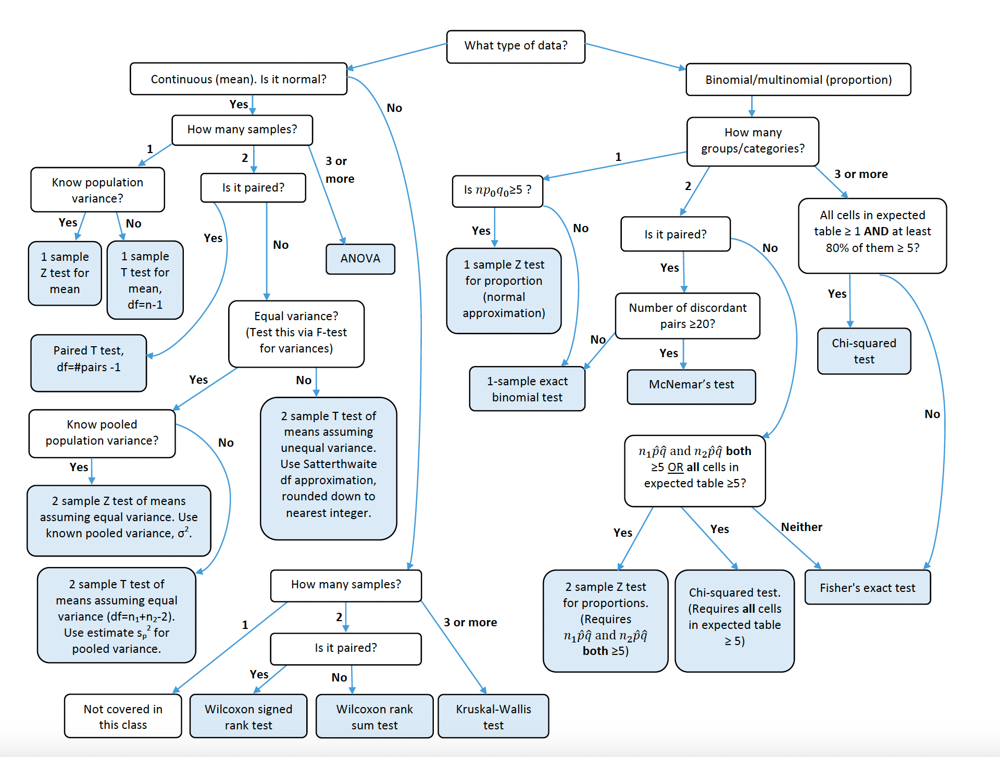

```{r setup, include=FALSE}
library(tidyverse)
# # check out:
tidyverse_packages()

# also install packages with install.packages()
# install.packages("skimr")
# can be useful if you have a small dataset that you want to summarize quickly
library(skimr) 

# this is one of several packages that can make tables of summary statistics
library(qwraps2)
library(kableExtra) # this is another option

# this pkgs can be used to quickly reshape/process "statistical" objects into dataframes
library(broom)

# note that the `stats` package comes along with base R, and it already has many of the
  # useful univariate & bivariate tests &
  # functions for linear and generalized linear models
  # other regression models or particular tests will be in other packages 
  # (e.g., lme4, lmerTest, caret, rf, etc)

# this is an example dataset (n=20) of child birthweights with info about the parents
lbw_example <- read.csv("lbw_data_example.csv")

# this is a larger version of the dataset (used later)
load("lbw_data_small.Rdata")

knitr::opts_chunk$set(echo = TRUE)

```

# An easy way to create a summary table

There are many packages that can help make tables containing summary statistics. Sometimes it can be easier to make them manually too. Below shows how to quickly get a summary of all the variables in a dataframe using `skimr`. Then, I show one example of how to make a more finalized summary table using `qwraps2`.

```{r quick.summary}

skim(lbw_example)

skim(lbw_example$child_birthwt)

# summary() is similar
summary(lbw_example)

summary(lbw_example$child_birthwt)

```

```{r qwraps.example, results = 'asis'}
options(qwraps2_markup = 'markdown')

# qwraps2 requires a list of lists to make the table, like this:
summary.stats1 <- 
  list("Birthweight [g]" = 
         list("Min" = ~round(min(child_birthwt)),
              "Median" = ~round(median(child_birthwt)),
              # mean_sd comes from qwraps2
              "Mean" = ~qwraps2::mean_sd(child_birthwt, digits = 0),
              "Max" = ~round(max(child_birthwt))))

qwraps2::summary_table(lbw_example, summary.stats1)

# can also report broken down by group: 
summary_table(lbw_example, summary.stats1, by = "use_tobacco")


```

You also also save the output directly as a csv file:

```{r}

example.table <- summary_table(lbw_example, summary.stats1, by = "use_tobacco")

# this can be directly saved as a csv (note: the plus/minus character will look weird):
write.csv(example.table, "example_table.csv")

```

# Overview of non-parametric and parametric testing

You may already be familiar with a lot of this, so hopefully this is a good recap if so.

Nonparametric tests put few assumptions, if any, on the underlying population that a sample is drawn from. In contrast, parametric tests use distributional assumptions. However, the general approach to using either set of tests is the same:

-   Specify null ($H_0$) and alternative hypotheses ($H_A$)
-   Set the level of significance (commonly $\alpha = 0.05$)
-   Calculate a test statistic
-   Based on the value of the test statistic, either reject or do not reject $H_0$

A flowchart with suggestions for which tests to use is available at the end of this file.

# Examples of common parametric tests and their counterparts

You're probably familiar with the t-test. The two-sample t-test is used to compare sample means. Two-sample t-tests can be paired or unpaired, depending on whether the observations in each sample have a corresponding observation in the other sample. For unpaired tests, you assume that the observations in each group were independently sampled.

For a two-sample t-test, our null hypothesis is (typically) that the means are equal and the alternative hypothesis is that the means are not equal:

$$
H_0: \mu_1 = \mu_2 \\
H_A: \mu_1 \ne \mu_2 
$$

We're able to reject $H_0$ if the difference in the sample means, $\bar{x}_1 - \bar{x}_2$, is far enough from 0. The t-statistic is used to make that decision:

$$
t = \frac{\bar{x}_1 - \bar{x}_2}{\sqrt{s_p^2(\frac{1}{n_1} + \frac{1}{n_2})}}
$$

$s^2_p$ is the pooled estimate of the variance, which combines information from each sample. This assumes that the variances are equal, although there are versions of the t-test available in your programming software assume unequal variances. Ultimately, the t-statistic calculated above is compared to a $t$ distribution to find a $p$-value. The degrees of freedom (and width of the tails) of the $t$ distribution depend on the sample sizes. Assuming the null hypothesis is true, this is the probability of observing a difference in means as large or larger than $\bar{x}_1 - \bar{x}_2$. If $p < \alpha$, the null hypothesis is rejected; otherwise, you fail to reject $H_0$. Your software will likely do all of these steps on its own.

This t-test also assumes that the means in each of the populations are normally distributed. This assumption can be hard to meet if the sample sizes are small (and especially if small and non-normal). (In such situations, the mean of the sample may also not be very informative.) For a situation like this, a non-parametric test like the Wilcoxon rank sum test (AKA Mann-Whitney U test) may be helpful. For continuous data, the null hypothesis of this test is that the median of each population is equal and the alternative is that the medians are not equal. The test does the following:

-   Combine the data from the two groups and rank all the observations from smallest to largest

    -   Tied values are assigned an average rank

-   Calculate $R_1$, which the sum of the ranks corresponding to group 1

Under the null hypothesis ($H_0$), we would expect the sum of the ranks in each group to be about equal. If $R_1$ is too small or too large than what we would expect under $H_0$, we have evidence to reject $H_0$. Again, your software does all of these calculations. (Note that when ties occur, you may have to specify how the p-values should be calculated.)

Unlike the t-test, the Wilcoxon rank sum test can be extended to ordinal data. Because the Wilcoxon rank sum test only uses ranks of the observations, it is less sensitive to outliers, especially when the sample size is small. One last note: it's important to recognize that these tests have different null and alternative hypotheses.

Now here is an example of each of these tests with the test dataset. We'll compare birthweights among children born to mothers who used/did not use tobacco.

```{r twosample.tests}
# the stats library has both the t-test and wilcoxon tests
t.test(formula = child_birthwt ~ use_tobacco, 
       data = lbw_example)
       # by default, this is a unpaired two-sided t-test with unequal variance

example.t <- t.test(formula = child_birthwt ~ use_tobacco, 
                    data = lbw_example)

# this function from broom cleans up the output of statistical objects
example.t <- tidy(example.t)

# this is equivalent to the above
t.test(x = lbw_example$child_birthwt[lbw_example$use_tobacco==0], 
       y = lbw_example$child_birthwt[lbw_example$use_tobacco==1], 
       data = lbw_example)

wilcox.test(formula = child_birthwt ~ use_tobacco, 
            data = lbw_example, exact = FALSE)
  # by default, this is a unpaired two-sided test

example.wilcox <- wilcox.test(formula = child_birthwt ~ use_tobacco, 
                              data = lbw_example, exact = FALSE)

tidy(example.wilcox)

```

# Additional materials

## More than 2 groups

Below is also an example of an analysis of variance (ANOVA) test that compares birthweights between several categories (based on mothers' ages). ANOVA (see diagram) is useful when comparing 3 or more groups. A non-parametric counterpart is the Kruskall-Wallis test, which also compares ranks between each group.

When comparing several groups, you may also be interested in pairwise comparisons. In this case, it's advisable to adjust for having done multiple comparisons to keep the (type I) error rate across all tests at less than or equal to $\alpha$. A common method is to use a "Bonferroni correction", which just divides $\alpha$ by the number of tests that will be conducted. (Note: This can be overly conservative if you do a large number of tests or if the outcomes you're investigating are correlated.)

Another option is [Tukey's honest significant differences](https://personal.utdallas.edu/~herve/abdi-HSD2010-pretty.pdf) method, which is commonly done after conducting an ANOVA. An example using this (with `tukeyHSD`) is shown below. Based on my understanding, this method requires a larger difference in the mean (compared to a t-test) to reject the null hypothesis.

```{r threeplus.groups}

lbw_example <- lbw_example %>%
mutate(mother_age_cat = case_when(mother_age >= min(mother_age) & mother_age < 25 ~ "<25",
                                  mother_age >= 25 & mother_age < 30 ~ "25-29",
                                  mother_age >= 30 ~ "30+")
       )

bw_aov <- aov(child_birthwt ~ mother_age_cat, data = lbw_example)

# fail to reject H0 that the mean birthweights are equal
summary(bw_aov)

# same here
kruskal.test(child_birthwt ~ mother_age_cat, data = lbw_example)

```

```{r}

# here is the same, but with a larger version of the birthweight dataset
lbw_data <- lbw_data %>%
mutate(mother_age_cat = case_when(mother_age >= min(mother_age) & mother_age < 25 ~ "<25",
                                  mother_age >= 25 & mother_age < 30 ~ "25-29",
                                  mother_age >= 30 ~ "30+")
       )

bw_aov <- aov(child_birthwt ~ mother_age_cat, data = lbw_data)

# here, we reject H0 that the mean birthweights are equal
summary(bw_aov)

# same here
kruskal.test(child_birthwt ~ mother_age_cat, data = lbw_data)

# when we can reject H0, we may want to conduct pairwise comparisons (t-test or KW test)
# or using Tukey HSD
pairwise_lbw <- tidy( TukeyHSD(bw_aov) ) # tidy cleans output into a dataframe

# View(pairwise_lbw)

```

## Demonstrating the Central Limit Theorem

The example below is meant to show some of the power of the Central Limit Theorem (CLT). The CLT states that, as the sample sizes increases, the distribution of sample averages generated by random draws from a population becomes increasingly normal with a mean equal to the population mean and variance proportional to the sample size. This holds even if the underlying populations are not normal.

Mathematically, this looks like the following, as $n$ increases:

$$
\bar{x} \sim \mathcal{N}\left(\mu, \frac{\sigma^2}{n} \right)
$$

where $\bar{x}$ is the sample mean, $\mu$ is the population mean, and $\frac{\sigma^2}{n}$ is the variance of the sample mean.

The example below demonstrates this for sample draws from a lognormal distribution.

```{r}
# draw 100 observations from lognormally distributed population
dat_lognorm <- exp(rnorm(n = 100, mean = 0, sd = 1))

# this is the geometric mean, which should be close to exp(0) = 1
# exp(mean(log(dat_lognorm)))

# verify that this looks lognormal
hist(dat_lognorm)

hist( log(dat_lognorm) )

```

Now let's repeatedly draw samples from a log-normally distributed population. In each sample, we'll calculate the (sample) average and save it for later. Then we'll see the distribution of these averages across all of our draws from the population.

For fun, you can try changing the distribution of the underlying population or the parameter that is calculated for each sample (e.g., geometric mean, median, etc). The CLT also supports that the difference in sample means is also approximately normally distributed, even if the underlying population distributions are not normal. This is why the t-test can still be okay to use if the sample size is large.

```{r, eval=FALSE}

set.seed(12042023)

one.sample_lognorm.f <- function(n.obs = NULL) {
  
  one.samp <- exp(rnorm(n = n.obs, mean = 0, sd = 1))
  
  one.sample.mean <- mean(one.samp)
  
  return(one.sample.mean)

}

# check that it works
one.sample_lognorm.f(n.obs = 1)

# now we'll do 10k draws, increasing the sample size each time
  # one observation in each sample
  sample.means <- replicate(n = 10000, one.sample_lognorm.f(n.obs = 1))
  
  hist(sample.means, breaks = 50)
  
  sample.means <- replicate(n = 10000, one.sample_lognorm.f(n.obs = 10))
  
  hist(sample.means, breaks = 50)
  
  sample.means <- replicate(n = 10000, one.sample_lognorm.f(n.obs = 30))
  
  hist(sample.means, breaks = 50)
  
  sample.means <- replicate(n = 10000, one.sample_lognorm.f(n.obs = 100))
  
  hist(sample.means, breaks = 50)
  
  # all the way up to sample sizes of 1000
  sample.means <- replicate(n = 10000, one.sample_lognorm.f(n.obs = 1000))
  
  hist(sample.means, breaks = 50)
  
```

Regression methods are not covered in this doc, but the CLT is especially powerful because it is also often used to construct confidence intervals for regression coefficients.

\newpage

# Hypothesis testing flowchart


